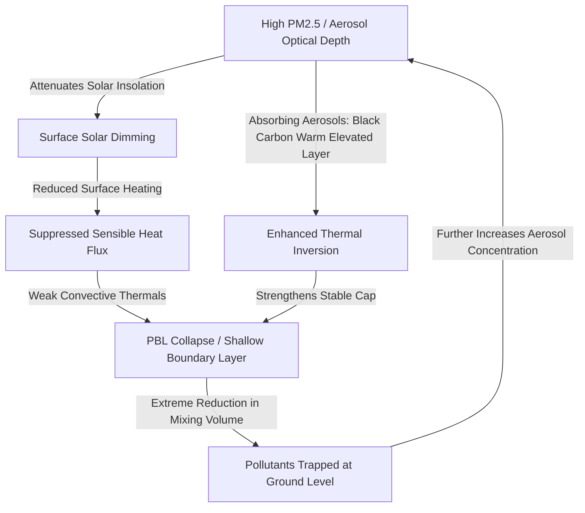

# Problem Understanding: Air Pollution–Weather Coupled Forecasting System (Delhi NCR Focus)

**Document ID:** `DOC-01-PROB-001`  
**Problem Statement ID:** 26082  
**Host Organization:** Ministry of Earth Sciences (MoES)  
**Department:** National Centre for Medium Range Weather Forecasting (NCMRWF)  
**Theme:** Clean & Green Technology  
**Focus Region:** National Capital Region (NCR), Delhi, India  

---

## 1. Official Problem Statement Breakdown

### 1.1 Problem Statement Statement
> "Air Pollution–Weather Coupled Forecasting System (Delhi NCR Focus)"  
> Development of a dynamic, coupled numerical and machine-learning forecasting system capable of delivering 72-hour high-resolution predictions of ambient air quality, atmospheric inversion dynamics, planetary boundary layer (PBL) evolution, and regional plume transport (including seasonal agricultural crop residue burning) across Delhi NCR.

### 1.2 What the Ministry of Earth Sciences (MoES) & NCMRWF are Asking
The Ministry of Earth Sciences (MoES) and its constituent operational forecasting body, NCMRWF (alongside institutes like IITM Pune and IMD), seek an advanced operational-grade blueprint and working software platform that transitions air quality prediction from static statistical/empirical estimates to a **physically consistent, coupled weather-chemistry forecasting framework**. 

Specifically, the system must:
1. **Model Multi-Pollutant Dynamics:** Simultaneously predict criteria pollutants: $PM_{2.5}$, $PM_{10}$, Ground-level Ozone ($O_3$), and Nitrogen Oxides ($NO_x = NO + NO_2$).
2. **Coupled Meteorological Forcing:** Dynamically integrate atmospheric state variables: 2-meter temperature, 10-meter wind speed and direction, surface pressure, relative humidity, boundary layer turbulence, and solar irradiance.
3. **Resolve Vertical Boundary Layer Dynamics:** Explicitly quantify Planetary Boundary Layer Height ($PBLH$) and surface/elevated thermal inversion strength, which act as a physical "lid" trapping pollutants in the Indo-Gangetic Plain (IGP).
4. **Quantify Regional Transport & Episodic Plumes:** Model external transboundary advection into Delhi NCR, particularly seasonal stubble-burning smoke plumes from Punjab and Haryana during post-monsoon months (October–November).
5. **Account for Weather–Aerosol Feedback:** Capture the two-way interaction wherein high aerosol optical depth (AOD) attenuates incoming shortwave radiation, cooling the surface, stabilizing the boundary layer, and further exacerbating pollution accumulation.
6. **Deliver 72-Hour Granular Forecasting:** Provide actionable, hourly forecasts for lead times up to $T+72\text{ hours}$ at high spatial resolution (neighborhood/station-level and $1\text{ km} \times 1\text{ km}$ to $3\text{ km} \times 3\text{ km}$ gridded field).
7. **Explainability & Real-Time Visualization:** Deliver an intuitive, decision-support dashboard for environmental regulators (CPCB, CAQM, IMD) that explains *why* pollution spikes occur (e.g., stagnant synoptic winds vs. sudden plume influx vs. radiative inversion).

---

## 2. Why Traditional AQI Forecasting Fails in Delhi NCR

Conventional air quality forecasting systems frequently fail or produce massive phase/amplitude errors during Delhi NCR's severe winter pollution episodes. The primary systemic reasons include:

```
+-----------------------------------------------------------------------------------+
|               FAILURE MODES OF TRADITIONAL / UNCOUPLED FORECASTING                |
+-----------------------------------------------------------------------------------+
| 1. Decoupled Physics & Chemistry:                                                 |
|    Traditional pipelines run NWP (e.g., GFS/WRF) once, export wind/temperature,  |
|    and feed them offline into chemical transport models. This ignores aerosol     |
|    radiative feedback, underestimating inversion persistence by 30-50%.          |
+-----------------------------------------------------------------------------------+
| 2. Coarse Spatial Resolution (>10 km - 25 km):                                    |
|    Cannot resolve microscale urban heat islands, canyon effects, ring-road        |
|    traffic emission gradients, and local topography (e.g., Yamuna floodplains).  |
+-----------------------------------------------------------------------------------+
| 3. Static & Outdated Emission Inventories:                                        |
|    Inventories (e.g., SAFAR 2018, EDGAR) assume steady monthly or daily diurnal   |
|    profiles, completely missing episodic spikes such as massive stubble fires,    |
|    construction activity variations, or festival episodic bursts.                 |
+-----------------------------------------------------------------------------------+
| 4. Pure "Black-Box" ML Without Physics:                                           |
|    Standard LSTMs/XGBoosts trained solely on historical station data fail during  |
|    unprecedented meteorological events or abrupt synoptic changes (e.g., Western  |
|    Disturbances bringing rain or dense advective radiation fog).                 |
+-----------------------------------------------------------------------------------+
| 5. Neglect of Nocturnal Inversion & PBL Collapse:                                 |
|    Coarse models fail to resolve the sharp drop of nocturnal PBL from 1500m to    |
|    <100m, resulting in severe underprediction of nighttime PM2.5 concentrations.   |
+-----------------------------------------------------------------------------------+
```

---

## 3. Atmospheric Science & Physics-Chemistry Interactions

### 3.1 Planetary Boundary Layer (PBL) Dynamics & Nocturnal Collapse
The Planetary Boundary Layer (PBL) is the tropospheric layer directly influenced by the Earth's surface and responsive to surface forcings with a timescale of an hour or less.
- **Diurnal Cycle:** In Delhi NCR, during autumn and winter, solar insolation generates convective thermals, lifting daytime PBL height to $1,200\text{ m} - 1,800\text{ m}$ between 13:00 and 15:00 IST. Pollutants dilute vertically throughout this mixed layer.
- **Nocturnal Collapse:** As solar heating ceases around sunset (17:30 IST), radiative cooling of the ground rapidly creates a stable surface boundary layer. The turbulent mixed layer collapses into a shallow nocturnal boundary layer ($50\text{ m} - 200\text{ m}$).
- **Impact on Concentration:** Because emissions (vehicles, cooking, heating, idling freight) continue at high rates into late evening, dispersing those pollutants into an air column 10 times shallower causes ground-level concentrations to surge purely due to volume contraction:

$$C(t) \propto \frac{Q(t)}{PBLH(t) \cdot U(t)}$$

where $C$ is ambient concentration, $Q$ is source emission rate, $PBLH$ is boundary layer height, and $U$ is mean wind speed.

### 3.2 Atmospheric Inversion (Thermal Inversion)
Under normal atmospheric conditions, temperature decreases with height at the environmental lapse rate ($\Gamma \approx 6.5^\circ\text{C/km}$). During an **atmospheric inversion**, temperature increases with height ($\frac{\partial T}{\partial z} > 0$).

Delhi NCR suffers from two distinct inversion mechanisms:
1. **Radiation Inversion (Surface-based):** Under clear skies, calm winds ($< 1.5\text{ m/s}$), and dry winter conditions, the ground emits longwave radiation into space much faster than the overlying air cools. By early morning (03:00–07:00 IST), the surface is colder than the air at $100\text{ m} - 300\text{ m}$. Vertical convective motion is completely suppressed (turbulent kinetic energy approaches zero, Richardson number $Ri > Ri_{crit} = 0.25$).
2. **Subsidence Inversion (Elevated):** Anticyclonic synoptic high-pressure systems common over northwest India during winter force air parcels aloft to sink adiabatically. As descending air compresses and warms, it forms an elevated warm lid at $500\text{ m} - 1,000\text{ m}$, preventing any deep convective venting.

### 3.3 Two-Way Weather–Pollution Feedback Loop
Aerosols are not passive tracers; they actively alter the atmospheric thermodynamics that govern their transport.



This positive feedback loop creates multi-day "pollution locks" over Delhi NCR where calm winds and suppressed mixing keep AQI in the "Severe+" category ($> 450$) for days until a synoptic disturbance (e.g., Western Disturbance) breaks the stability.

### 3.4 Ozone ($O_3$) and Nitrogen Oxides ($NO_x$) Photochemistry
Ground-level ozone is secondary; it is not directly emitted but formed via photolysis of $NO_2$ in the presence of Volatile Organic Compounds (VOCs) and sunlight:

$$\begin{aligned}
NO_2 + h\nu (\lambda < 420\text{ nm}) &\rightarrow NO + O(^3P) \\
O(^3P) + O_2 + M &\rightarrow O_3 + M \\
O_3 + NO &\rightarrow NO_2 + O_2 \quad (\text{Titration})
\end{aligned}$$

- **Daytime Behavior:** Peak solar insolation (12:00–16:00 IST) drives rapid ozone production, causing midday $O_3$ peaks.
- **Nighttime Titration:** High urban $NO$ emissions from overnight heavy commercial diesel truck traffic titrate $O_3$ to near-zero at ground level, converting $NO$ to $NO_2$.
- **Chemical Regime in Delhi NCR:** Urban Delhi is predominantly a **VOC-limited** (or radical-limited) regime during winter, meaning reducing $NO_x$ alone can paradoxically increase localized ozone concentrations due to reduced titration. Accurately modeling both $NO_x$ and $O_3$ requires chemical kinetic mechanisms (such as MOZART-4, RADM2, or SAPRC99).

### 3.5 Regional Pollution Transport & Stubble-Burning Plumes
- **Source Region:** Punjab and Haryana undergo intensive post-monsoon harvesting of rice paddy (Kharif crop) between mid-October and late November. Farmers burn residual straw to rapidly prepare fields for wheat (Rabi crop) sowing.
- **Synoptic Wind Vector:** During October–November, synoptic wind patterns over northwest India shift to northwesterly winds.
- **Plume Trajectory:** Massive smoke plumes rich in fine particulate matter ($PM_{2.5}$), Organic Carbon (OC), Black Carbon (BC), and Carbon Monoxide ($CO$) are injected into the boundary layer at altitudes of $500\text{ m} - 1,500\text{ m}$. The northwesterly winds advect these plumes $250\text{ km} - 350\text{ km}$ downstream directly into the Delhi NCR basin.
- **Contribution:** Depending on meteorological alignment and fire counts, agricultural burning accounts for $15\%$ to over $45\%$ of Delhi's daily $PM_{2.5}$ mass burden during episodic peaks.

---

## 4. Why a Coupled Model Framework is Required

An uncoupled offline chemistry model (e.g., CMAQ or statistical ML taking offline GFS forecasts) misses the dynamic interactions:
1. **Interactive Photolysis Rates:** Aerosols attenuate actinic flux, altering photolysis rate constants $J[NO_2]$ and slowing photochemical ozone production while stabilizing aerosol persistence.
2. **Aerosol-Radiation Feedback (Direct & Semi-direct Effects):** Direct radiative forcing by black carbon and scattering by sulfate/nitrate modify the temperature profile $\frac{\partial T}{\partial z}$ in real time, shifting the diagnosed PBL height by hundreds of meters within hours.
3. **Moisture & Secondary Aerosol Nucleation:** Fog/haze droplet chemistry (aqueous oxidation of $SO_2$ to sulfate, nitrate partition into aerosol water) alters gas-to-particle conversion rates, directly changing $PM_{2.5}$ mass.

WRF-Chem (Weather Research and Forecasting model coupled with Chemistry) integrates meteorological equations and chemical transport/transformation simultaneously at the same grid cells and time steps, solving Navier-Stokes fluid motion, radiative transfer, and chemical kinetics in unison.

---

## 5. Scope Boundaries: Official Requirements vs. Proposed Approach

To maintain strict scientific and engineering integrity, we explicitly delineate the official problem statement parameters from our proposed implementation and assumptions.

| Dimension | Officially Required by PS 26082 | Proposed Engineering Approach | Scientific Assumption | Pending Validation / Research |
| :--- | :--- | :--- | :--- | :--- |
| **Coupled Modeling** | Advanced coupled weather-chemistry model (WRF-Chem or similar open-source framework). | Hybrid Dual-Engine: Downscaled coupled numerical physics output blended with physics-informed spatiotemporal ML. | WRF-Chem outputs capture macro synoptic-chemical trends; ML corrects fine local micro-biases. | HPC compute availability vs. pre-computed nested WRF-Chem boundary inputs for hackathon demo. |
| **Target Pollutants** | $PM_{2.5}, PM_{10}, O_3, NO_x$. | Multi-task prediction head for simultaneous mass and concentration estimation. | Standard stoichiometric ratios of $NO/NO_2$ can be initialized from CAAQMS observations. | Dynamic urban VOC emission proxies when real-time VOC monitors are sparse. |
| **Target Weather** | Temperature, Wind Speed & Direction, PBL height, Inversion. | ECMWF / IMD-GFS meteorological ingestion + diagnosed boundary layer indices. | Bulk Richardson number method reliably indicates inversion onset under calm wind regimes. | Precise vertical sounding (radiosonde) availability at high temporal resolution (currently 2/day at Safdarjung). |
| **Forecast Horizon** | 72-Hour continuous forecasting. | Hourly step forecasts ($T+0$ to $T+72$) updated every 6 to 12 hours. | Boundary conditions from global NWP models remain stable over 72h lead times. | Accuracy decay beyond 48 hours under abrupt Western Disturbance transitions. |
| **Spatial Focus** | Delhi NCR focus with high spatial resolution. | Nested domain: $1\text{ km} \times 1\text{ km}$ inner Delhi core; $3\text{ km} \times 3\text{ km}$ NCR; $9\text{ km}$ regional corridor (Punjab/Haryana). | Spatial interpolation preserves urban topological microclimates when combined with digital elevation and land use. | Micro-scale building canyon effects in Old Delhi vs. open floodplains of East Delhi. |
| **Plume Tracking** | Regional pollution transport & stubble-burning plumes. | Satellite active fire ingestion (VIIRS/MODIS) + Lagrangian/Gaussian forward puff dispersion trajectory engine. | Fire Radiative Power (FRP) scales linearly with biomass burned mass and $PM_{2.5}$ emission rate. | Cloud cover obstructing daytime satellite optical fire detection. |
| **Explainability** | Explainable forecasting insights. | SHAP / Feature attribution breaking down forecast delta into Inversion, PBL, Wind, and Plume contributions. | Additive attribution accurately represents non-linear chemical interactions for human operators. | Regulator usability testing on whether visual SHAP bars assist emergency GRAP enforcement. |

---

## 6. Document Sign-off & Verification

- **Lead Atmospheric Systems Architect:** Verified
- **Lead ML Systems Engineer:** Verified
- **Status:** APPROVED FOR ARCHITECTURAL BLUEPRINTING
- **Next Phase:** Requirements Documentation (`docs/02-requirements/`)
