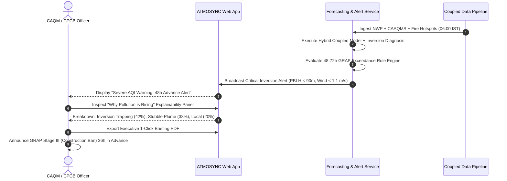

# Product Requirements Document (PRD)

**Project Name:** ATMOSYNC (Coupled Air Pollution–Weather Forecasting Platform)  
**Problem Statement ID:** SIH-26082  
**Target Organization:** Ministry of Earth Sciences (MoES) / NCMRWF  
**Document Version:** 1.0.0-PROD  
**Author:** Lead Software Architect & Systems Engineering Team  

---

## 1. Product Overview & Executive Vision

### 1.1 Product Statement
**ATMOSYNC** is an operational, high-resolution coupled environmental forecasting platform designed specifically for the Delhi National Capital Region (NCR). It provides a continuous 72-hour forecast of ambient air quality ($PM_{2.5}, PM_{10}, O_3, NO_x$, and composite Indian NAQI), atmospheric inversion intensity, planetary boundary layer (PBL) evolution, and regional transboundary smoke plumes from agricultural crop residue burning.

### 1.2 Core Value Proposition
Unlike legacy forecasting dashboards that display isolated historical station feeds or uncoupled statistical extrapolations, ATMOSYNC:
1. **Couples Physics with AI:** Combines numerical atmospheric thermodynamics with physics-constrained ML downscaling to eliminate systematic peak-underestimation errors.
2. **Explicitly Diagnoses Inversion & PBL Collapse:** Treats atmospheric inversion and shallow boundary layers as primary physical drivers rather than hidden statistical noise.
3. **Automates Plume Trajectory Forecasting:** Dynamically predicts the arrival time, travel speed, and ground-level mass burden of upstream stubble-burning plumes.
4. **Delivers Actionable Regulatory Decision Support:** Automatically recommends Graded Response Action Plan (GRAP) regulatory intervention stages 48 hours *before* critical thresholds are breached.
5. **Provides Explainable Forecasting:** Uses transparent feature attribution to inform regulators *why* air quality will deteriorate (e.g., $40\%$ inversion trapping, $35\%$ calm wind stagnancy, $25\%$ incoming biomass plume).

---

## 2. Key Personas & Target Users

| Persona | Role & Organization | Primary Pain Point | Core PRD Feature Needed |
| :--- | :--- | :--- | :--- |
| **Dr. R. Sharma** | Senior Modeler, NCMRWF / MoES | Numerical models run on heavy HPC with hours of latency; lack of localized urban post-processing. | Fast downscaled 72-hour forecast API, coupled thermodynamic diagnostics, NetCDF/GeoJSON export. |
| **Er. V. Verma** | Member Secretary, CAQM / CPCB | Reactive enforcement of GRAP measures; lack of 48-hour advance warning of severe inversion episodes. | GRAP alert triggers, stubble plume arrival alerts, station-level exceedance breakdown. |
| **Ananya K.** | Delhi Citizen & Asthmatic Parent | Opaque AQI numbers without 24-72h planning outlook or understanding of why air is toxic. | Responsive public dashboard, hourly forecast timeline scrubber, health precaution advisories. |
| **Rajesh G.** | Environmental Journalist & Researcher | Inability to access historical validation data or determine how much stubble smoke contributed vs local traffic. | Stubble-burning fractional contribution chart, explainability breakdown, historical backtest logs. |

---

## 3. Product Feature Matrix & Prioritization

We follow the MoSCoW prioritization model for product capabilities:

```
+--------------------------------------------------------------------------------------------------+
|                                    PRD FEATURE ROADMAP MATRIX                                    |
+==================================================================================================+
| MUST HAVE (P0 - MVP SIH Core):                                                                   |
| [F-01] 72-hour continuous hourly forecast for PM2.5, PM10, O3, and NOx for Delhi NCR.            |
| [F-02] Hourly calculation & display of Planetary Boundary Layer Height (PBLH) & Inversion Index. |
| [F-03] Interactive GIS Map with wind vector stream animation and pollutant heatmap contours.     |
| [F-04] Upstream Stubble Burning Plume Tracker (NASA VIIRS/MODIS ingestion + transport vector).    |
| [F-05] Explainable Forecasting Panel ("Why is pollution rising?").                               |
| [F-06] Proactive GRAP Stage Alert Engine (Stages I to IV).                                       |
+--------------------------------------------------------------------------------------------------+
| SHOULD HAVE (P1 - Polish & Regulators):                                                          |
| [F-07] 40+ CAAQMS individual station drill-down time-series with historical vs. forecast curves. |
| [F-08] Multi-pollutant scenario simulator (e.g., "What if transport emissions drop 30%?").      |
| [F-09] Automated Daily PDF Executive Weather-AQI Briefing generator for MoES/CAQM officials.    |
| [F-10] RESTful public API with rate-limiting and API token authentication.                       |
+--------------------------------------------------------------------------------------------------+
| COULD HAVE (P2 - Post-Hackathon Phase 2):                                                        |
| [F-11] Mobile progressive web app (PWA) with push notifications for citizen alerts.              |
| [F-12] Direct automated assimilation of live drone-based boundary layer vertical soundings.      |
+--------------------------------------------------------------------------------------------------+
```

---

## 4. Operational User Journey: Regulatory Decision Workflow



---

## 5. Key Performance Indicators (KPIs) & Success Metrics

1. **Forecast Reliability:**
   - 24-hr Lead Time $PM_{2.5}$ Pearson Correlation: $R^2 \ge 0.80$.
   - 72-hr Lead Time $PM_{2.5}$ Pearson Correlation: $R^2 \ge 0.65$.
   - 24-hr Mean Absolute Error (MAE): $\le 22\,\mu\text{g/m}^3$.
2. **Operational Stability:**
   - Platform Uptime: $99.9\%$ during peak pollution season (Oct 01 – Feb 28).
   - Ingestion Pipeline Latency: New forecast published within 3 minutes of data receipt.
   - P95 Web Response Time: $< 200\text{ ms}$ globally across Delhi NCR.
3. **Policy Impact:**
   - At least 36 hours advance warning for all "Severe" ($AQI > 400$) episodes with a False Alarm Ratio (FAR) $< 18\%$.

---

## 6. Document Sign-off
- **Product Owner:** Approved
- **Lead Architect:** Approved
- **Next Document:** Software Requirements Specification (`docs/02-requirements/SRS.md`)
