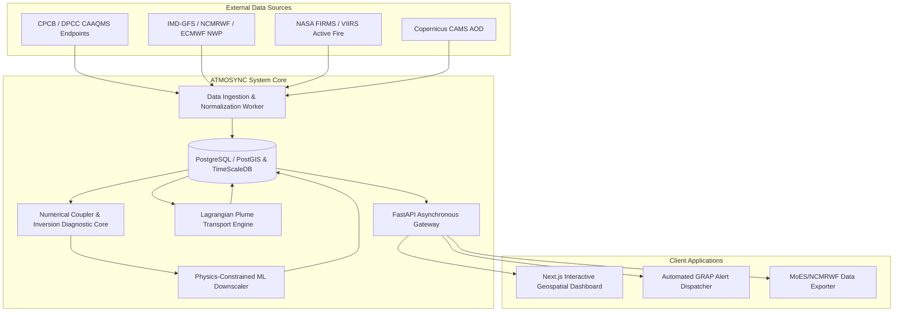

# Software Requirements Specification (SRS)
## Coupled Air Pollution–Weather Forecasting Platform (Delhi NCR)

**Document Standard:** IEEE Std 830-1998 Format  
**Document ID:** `DOC-02-SRS-001`  
**Version:** 1.0.0-FINAL  
**System Name:** ATMOSYNC  
**Sponsor:** Ministry of Earth Sciences (MoES) / NCMRWF  

---

## 1. Introduction

### 1.1 Purpose
This Software Requirements Specification (SRS) establishes the complete functional and non-functional engineering requirements for the **ATMOSYNC** platform. It provides the definitive technical specification governing backend data ingestion, numerical and machine-learning forecasting engines, persistence layers, RESTful APIs, and frontend geospatial visualizations.

### 1.2 Scope of the Software
ATMOSYNC is an integrated software system that ingests observational data from ground air quality monitoring networks, numerical weather prediction outputs, and satellite remote sensing data. It computes dynamic coupled weather-chemistry interactions, diagnoses atmospheric inversion and planetary boundary layer metrics, models regional smoke plume trajectories, and generates continuous 72-hour forecasts at hourly resolution for Delhi NCR.

---

## 2. Overall Description

### 2.1 Product Perspective & Context Diagram



### 2.2 User Classes and Characteristics
1. **Atmospheric Scientists / NCMRWF Forecasters:** Expert users needing raw NetCDF/GeoJSON grids, vertical thermodynamic profiles, and model performance metrics.
2. **Environmental Regulators (CPCB/CAQM):** Decision-makers focused on air quality index projections, GRAP alert compliance, and regional vs. local source apportionment.
3. **General Public / Civic Researchers:** End users accessing responsive map visualizations, station-level historical/forecast charts, and health advisories.

### 2.3 Operating Environment
- **Server OS:** Ubuntu Linux 22.04 LTS or containerized Linux environments (Docker / OCI compliant).
- **Client Browsers:** Modern Chromium-based browsers (Chrome, Edge $\ge$ v100), Firefox ($\ge$ v100), Safari ($\ge$ v15). WebGL 2.0 support required for hardware-accelerated vector wind streamline rendering.

---

## 3. Specific Functional Requirements

```
+--------------------------------------------------------------------------------------------------+
|                                    SRS FUNCTIONAL REQUIREMENTS                                   |
+==================================================================================================+
| [SRS-FR-001] Ingestion of Continuous Ambient Air Quality Data                                    |
| The system shall automatically poll and ingest hourly ambient concentrations of PM2.5, PM10,     |
| O3, NO2, SO2, CO from all operational CAAQMS stations in Delhi NCR, validating schema integrity. |
+--------------------------------------------------------------------------------------------------+
| [SRS-FR-002] Ingestion of Numerical Weather Prediction (NWP) Data                                |
| The system shall ingest gridded 3D meteorological profiles (U/V wind, T, RH, Pressure, Geopot-  |
| ential height at standard pressure levels: 1000, 925, 850, 700 hPa) from GFS/ECMWF datasets.    |
+--------------------------------------------------------------------------------------------------+
| [SRS-FR-003] Calculation of Planetary Boundary Layer Height (PBLH) & Inversion                   |
| The system shall calculate hourly PBLH and Bulk Richardson Number (Ri_b) vertical profiles to    |
| categorize Inversion Strength into: Weak (Ri_b < 0.25), Moderate (0.25 <= Ri_b < 1.0), and       |
| Strong (Ri_b >= 1.0) along with vertical lapse rate (dT/dz).                                     |
+--------------------------------------------------------------------------------------------------+
| [SRS-FR-004] Regional Stubble-Burning Plume Modeling                                             |
| The system shall ingest active fire locations and FRP from NASA VIIRS/MODIS and execute a        |
| forward Lagrangian dispersion model to output plume arrival time and estimated PM2.5 addition.   |
+--------------------------------------------------------------------------------------------------+
| [SRS-FR-005] 72-Hour Multi-Pollutant Multi-Station Forecast Generation                           |
| The system shall generate 72-hour hourly forecasts of PM2.5, PM10, O3, NOx, and Indian NAQI     |
| for every active CAAQMS station and a 1 km x 1 km regular grid over Delhi NCR.                  |
+--------------------------------------------------------------------------------------------------+
| [SRS-FR-006] Explainability Engine (XAI) Feature Attribution                                     |
| The system shall compute TreeSHAP or Integrated Gradient feature attributions for each forecast  |
| horizon, decomposing variance into Inversion Trapping, PBL Collapse, Wind Stagnation, and Plume. |
+--------------------------------------------------------------------------------------------------+
| [SRS-FR-007] Automated GRAP Rule-Based Alert Trigger                                             |
| The system shall evaluate predicted 24h average PM2.5/PM10 against CPCB GRAP criteria:           |
| Stage I (Poor), Stage II (Very Poor), Stage III (Severe), Stage IV (Severe+) 48 hours in advance.|
+--------------------------------------------------------------------------------------------------+
```

---

## 4. External Interface Requirements

### 4.1 User Interface Requirements
- **Responsive Dashboard:** Viewport support from desktop ($1920 \times 1080$) down to mobile ($375 \times 812$).
- **Map Controls:** Smooth zoom, pan, layer toggles ($PM_{2.5}, O_3, NO_x$, Inversion, Wind Streamlines, Fire Hotspots), and a 72-hour interactive scrubber bar with play/pause animations.
- **Color Palettes:** Strictly adhere to the official CPCB NAQI color scheme (Green: Good, Light Green: Satisfactory, Yellow: Moderate, Orange: Poor, Red: Very Poor, Dark Red/Purple: Severe).

### 4.2 Software Interfaces
- **Database Engine:** PostgreSQL 16+ with PostGIS 3.4 spatial extensions and TimescaleDB 2.14+ for time-series hypertable optimization.
- **REST API:** FastAPI application adhering to OpenAPI 3.1 specification returning JSON and GeoJSON payloads.
- **Map Tile Service:** MapLibre GL JS / Leaflet vector and raster tile endpoints.

---

## 5. Non-Functional Software Requirements

| Category | Requirement ID | Specification Description |
| :--- | :--- | :--- |
| **Performance** | `SRS-NFR-001` | P95 API response time $\le 200\text{ ms}$ under a load of 100 concurrent requests. |
| **Throughput** | `SRS-NFR-002` | Full 72-hour gridded + station forecast cycle executes in $\le 180\text{ seconds}$. |
| **Availability** | `SRS-NFR-003` | System operational uptime $\ge 99.5\%$ with automated Docker restart policies. |
| **Security** | `SRS-NFR-004` | All endpoints served over TLS 1.3; API key rate limiting of 60 req/min for public tiers. |
| **Data Quality** | `SRS-NFR-005` | Automated anomaly rejection filter removes sensor stuck values, negative spikes, and step jumps. |
| **Observability**| `SRS-NFR-006` | Structured JSON logging (Prometheus metrics & OpenTelemetry compliant traces). |

---

## 6. Document Sign-off
- **Lead Systems Engineer:** Approved
- **Next Document:** Functional Requirements Detailed (`docs/02-requirements/functional-requirements.md`)
