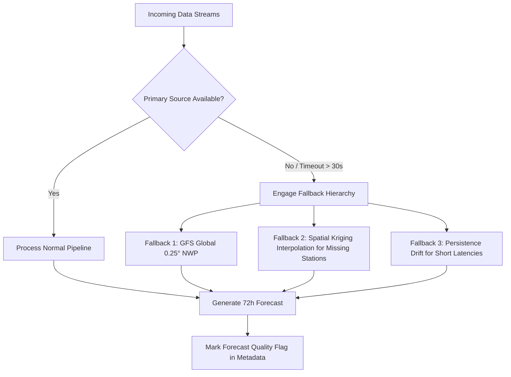

# Non-Functional Requirements (NFR) Specification

**Document ID:** `DOC-02-REQ-003`  
**System:** ATMOSYNC  
**Standard:** ISO/IEC 25010 System and Software Quality Requirements  

---

## 1. Performance & Computational Latency

```
+--------------------------------------------------------------------------------------------------+
| NFR-PERF-01: API Endpoint Response Time                                                          |
| - P50 Latency: <= 80 ms for standard station summary endpoints.                                  |
| - P95 Latency: <= 200 ms under a concurrent load of 150 requests/sec.                            |
| - P99 Latency: <= 500 ms for heavy GeoJSON polygon/vector tile queries.                          |
+--------------------------------------------------------------------------------------------------+
| NFR-PERF-02: 72-Hour Forecast Batch Execution Cycle                                              |
| - End-to-end model inference pipeline (data fetch -> physical diagnosis -> ML inference ->       |
|   spatial downscaling -> post-processing -> database commit) shall complete in <= 180 seconds.   |
+--------------------------------------------------------------------------------------------------+
| NFR-PERF-03: Frontend Map Rendering Performance                                                  |
| - Vector tile and streamline animation must sustain >= 55 FPS on standard desktop hardware and    |
|   >= 30 FPS on mid-range mobile devices with WebGL acceleration.                                  |
+--------------------------------------------------------------------------------------------------+
```

---

## 2. Scalability & Elasticity

- **Horizontal Scalability (`NFR-SCAL-01`):** The backend FastAPI gateway and data ingestion workers must be stateless, capable of running in multiple container instances behind an Nginx or Traefik reverse proxy.
- **Time-Series Hypertable Partitioning (`NFR-SCAL-02`):** Ground observations and forecast outputs in PostgreSQL/TimescaleDB must be automatically chunked by 7-day intervals with automated retention policies dropping raw scratch data after 90 days while preserving 1-hour analytical aggregates indefinitely.

---

## 3. Reliability, Availability & Fault Tolerance



- **Availability Target (`NFR-REL-01`):** $99.9\%$ uptime during the active winter pollution window (October 1 to February 28).
- **Graceful Degradation (`NFR-REL-02`):** In the event that satellite active fire data or high-resolution local weather soundings are unavailable, the system must degrade gracefully to numerical weather prediction boundary conditions without pipeline termination.
- **Self-Healing Containers (`NFR-REL-03`):** All background tasks and microservice containers must feature automated Docker healthchecks with restart policies (`restart: unless-stopped`).

---

## 4. Security & Access Control

- **Transport Security (`NFR-SEC-01`):** Enforce TLS 1.3 encryption across all public web and API endpoints. HTTP connections must automatically redirect to HTTPS with HSTS headers enabled.
- **API Authentication & Rate Limiting (`NFR-SEC-02`):** 
  - Public dashboard endpoints: Rate limited to 60 requests/minute per client IP (Token Bucket algorithm).
  - Administrative endpoints (model retraining, manual alert dispatch, inventory upload): Protected via OAuth2 / JWT bearer tokens with role-based access control (RBAC).
- **Sanitization & Input Validation (`NFR-SEC-03`):** All incoming parameters (dates, station IDs, coordinates) must be strictly validated using Pydantic schemas, rejecting SQL injection, XSS, and path-traversal attempts.

---

## 5. Observability, Logging & Telemetry

- **Structured Logging (`NFR-OBS-01`):** All application components must emit structured JSON logs containing timestamp, log level, correlation trace ID, module name, and execution duration.
- **Metrics Scraping (`NFR-OBS-02`):** Expose a `/metrics` endpoint compatible with Prometheus, reporting:
  - `inference_duration_seconds`
  - `ingestion_records_processed_total`
  - `active_stations_reporting_count`
  - `api_request_duration_seconds`
  - `memory_usage_bytes`

---

## 6. Scientific Validity, Reproducibility & Model Versioning

- **Deterministic Seed Control (`NFR-SCI-01`):** All ML models and stochastic numerical solvers must maintain configurable pseudorandom number seeds to ensure complete reproducibility across experimental runs.
- **Model Registry & Metadata (`NFR-SCI-02`):** Every forecast generated must persist the exact `model_version_id`, `training_cutoff_date`, and `feature_weights_checksum` in its database record to allow historical re-evaluation.
- **Data Provenance (`NFR-SCI-03`):** Every ingested meteorological and station record must retain its source attribution identifier (`cpcb_live`, `ecmwf_opendata`, `viirs_snpp`).

---

## 7. Document Sign-off
- **Lead Software Architect:** Approved
- **Next Document:** User Personas (`docs/02-requirements/user-personas.md`)
