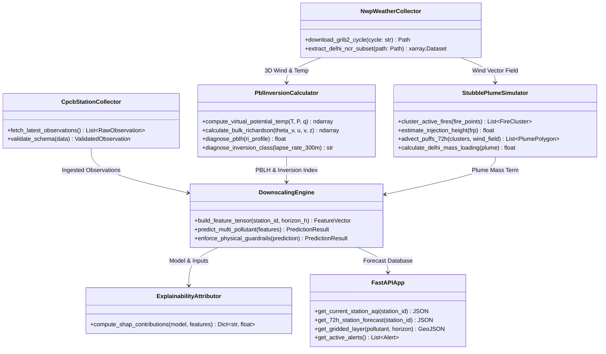

# Component Architecture Specification

**Document ID:** `DOC-03-ARCH-004`  
**System:** ATMOSYNC  
**Scope:** Internal Modular Decomposition & Service Contracts  

---

## 1. Modular Subsystem Decomposition

The software architecture is divided into five core loosely-coupled subsystems:

```
+--------------------------------------------------------------------------------------------------+
|                                    SUBSYSTEM DECOMPOSITION                                       |
+==================================================================================================+
| 1. atmosync-ingest:                                                                              |
|    - CpcbStationCollector: Scrapes / polls ground CAAQMS APIs.                                   |
|    - NwpWeatherCollector: Downloads GFS / ECMWF Open Data GRIB2 files.                          |
|    - SatelliteFireCollector: Ingests NASA FIRMS active fire hotspots.                            |
|    - DataCleanser: Outlier filtering, gap interpolation, and schema validation.                 |
+--------------------------------------------------------------------------------------------------+
| 2. atmosync-physics:                                                                             |
|    - VerticalProfileAnalyzer: Calculates theta_v, wind shear, and lapse rates.                   |
|    - PblInversionCalculator: Solves Bulk Richardson equations and classifies stability.          |
|    - VentilationIndexModule: Computes horizontal & vertical atmospheric cleansing potential.    |
|    - StubblePlumeSimulator: Implements Lagrangian forward puff advection and dispersion.         |
+--------------------------------------------------------------------------------------------------+
| 3. atmosync-ml:                                                                                  |
|    - FeatureStore: Materializes multi-source training/inference feature matrices.                |
|    - ModelRegistry: Manages versioned LightGBM and Spatiotemporal GNN weights.                   |
|    - DownscalingEngine: Executes 72-hour multi-pollutant inference for 40+ stations & 1km grid. |
|    - PostProcessingGuardrails: Enforces mass non-negativity and PM2.5 <= PM10 constraints.      |
|    - ExplainabilityAttributor: Generates TreeSHAP feature importance vectors per forecast step. |
+--------------------------------------------------------------------------------------------------+
| 4. atmosync-api:                                                                                 |
|    - StationController: Endpoints for current obs and station-level 72h curves.                  |
|    - ForecastController: Gridded NetCDF/GeoJSON slices across lead times T+1 to T+72.            |
|    - DiagnosticController: Inversion status, PBL height, and ventilation index endpoints.       |
|    - PlumeController: Active fire footprints, smoke trajectory polygons, and arrival ETAs.      |
|    - AlertController: GRAP stage compliance warnings and WebSocket event dispatchers.            |
+--------------------------------------------------------------------------------------------------+
| 5. atmosync-dashboard:                                                                           |
|    - MapEngine: MapLibre GL wrapper with custom WebGL particle streamline shader.               |
|    - TimelineScrubber: Global 72-hour playback controller (Now -> +72h).                         |
|    - StationModal: Multi-pollutant drill-down chart component with confidence intervals.        |
|    - ExplainabilityDrawer: Interactive SHAP factor attribution breakdown charts.                 |
|    - AlertBanner: Real-time GRAP warning notifications.                                          |
+--------------------------------------------------------------------------------------------------+
```

---

## 2. Component Interaction & Interfaces



---

## 3. Data Contracts & Payload Schemas

### 3.1 Station Forecast Contract (`StationForecastResponse`)
```json
{
  "station_id": "DEL_ANAND_VIHAR",
  "station_name": "Anand Vihar, Delhi - DPCC",
  "coordinates": {"lat": 28.6508, "lon": 77.3152},
  "generated_at": "2026-11-04T06:00:00Z",
  "forecast_horizon_hours": 72,
  "data": [
    {
      "horizon_hour": 1,
      "forecast_timestamp": "2026-11-04T07:00:00Z",
      "pm25": 284.5,
      "pm10": 412.0,
      "o3": 18.2,
      "nox": 142.6,
      "aqi": 421,
      "aqi_category": "Severe",
      "pblh_meters": 115.0,
      "inversion_status": "Strong",
      "wind_speed_mps": 1.1,
      "wind_direction_deg": 315.0,
      "attribution": {
        "inversion_trapping": 42.0,
        "stubble_plume": 32.5,
        "wind_stagnation": 15.5,
        "local_emissions": 10.0
      }
    }
  ]
}
```

---

## 4. Document Sign-off
- **Lead Software Architect:** Approved
- **Next Document:** Deployment Architecture (`docs/03-system-architecture/deployment-architecture.md`)
