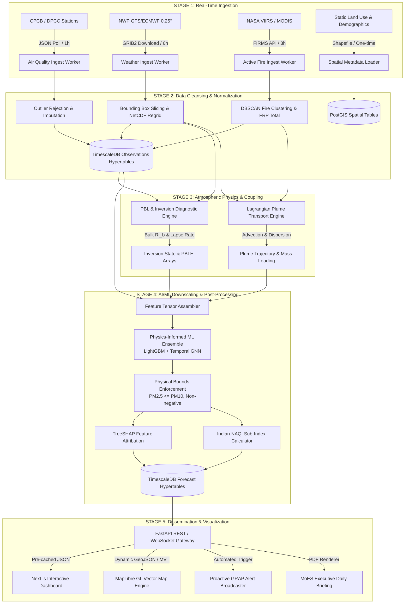

# End-to-End Data Flow Specification

**Document ID:** `DOC-03-ARCH-003`  
**System:** ATMOSYNC  
**Scope:** Data Ingestion, Processing, Forecast Execution, and Dissemination  

---

## 1. End-to-End Data Flow Architecture

The data lifecycle in ATMOSYNC operates through five synchronized execution stages:

---

## 2. Detailed Data Transformation Stages

### Stage 1: Data Ingestion & Sanitization
1. **Air Quality Records:** Hourly pollutant readings ($PM_{2.5}, PM_{10}, NO_2, SO_2, CO, O_3$) are parsed. Sensor errors (negative values, constant flatlines for $>4$ hours, single-step spikes $>400\,\mu\text{g/m}^3$) are replaced with null flags and imputed via inverse-distance weighted (IDW) interpolation from neighboring stations.
2. **NWP Fields:** GRIB2 meteorology files are subset over $27.0^\circ\text{N}-32.5^\circ\text{N}$, $74.0^\circ\text{E}-79.5^\circ\text{E}$. Temperature, wind components ($U, V$), relative humidity, and pressure geopotentials are extracted.
3. **Fire Hotspots:** VIIRS 375m I-band active fire pixels with confidence $\ge 30\%$ are aggregated using spatial DBSCAN clustering ($\epsilon = 10\text{ km}$) to identify major crop residue burn clusters and sum their Fire Radiative Power (MW).

### Stage 2: Physical Diagnosis & Coupled Processing
1. **Vertical Stability & Inversion:** The physical engine reads vertical potential temperature and wind shear arrays, calculating:
   $$\theta_v(z) = T(z) \cdot \left(\frac{1000}{P(z)}\right)^{0.286} \cdot (1 + 0.61 \cdot q(z))$$
   $$Ri_b(z) = \frac{g}{\theta_{v0}} \frac{(\theta_v(z) - \theta_{v0}) \cdot z}{u(z)^2 + v(z)^2}$$
   The exact height $z$ where $Ri_b = 0.25$ is stored as $PBLH$. Temperature lapse rate $\Gamma = \frac{T_{300m} - T_{sfc}}{300m}$ diagnoses surface inversion.
2. **Smoke Plume Forward Advection:** Each fire cluster releases Gaussian puffs advected forward in 1-hour timesteps by the $10\text{m} - 850\text{hPa}$ wind vector. Plume dispersion coefficients ($\sigma_y, \sigma_z$) expand with distance, and downwind ground concentrations entering Delhi NCR are computed.

### Stage 3: ML Downscaling & Bias Correction
1. **Feature Engineering:** For each forecast timestamp $t \in [T+1, T+72]$:
   - Target station lag features ($t-1, t-2, t-24$)
   - Forecasted NWP weather ($T_{2m}, RH, U_{10}, V_{10}, P_{sfc}$)
   - Diagnosed physical metrics ($PBLH(t), Ri_b(t), \Gamma(t), \text{Ventilation Index}$)
   - Upstream stubble plume mass loading contribution ($\Delta PM_{2.5}^{plume}(t)$)
   - Cyclic calendar encoding ($\sin/\cos$ of hour-of-day, day-of-week, day-of-year)
2. **Model Inference:** LightGBM multi-target regressors predict $PM_{2.5}, PM_{10}, O_3, NO_x$ concentrations.
3. **Physical Constraint Guardrails:** 
   - $PM_{2.5} \leftarrow \min(PM_{2.5}, PM_{10})$
   - $PM \leftarrow \max(0, PM)$
4. **Attribution:** TreeSHAP computes Shapley values for the 5 primary driver categories.

### Stage 4: Storage & Caching
- Generated 72-hour forecasts for all 40+ stations and 1 km grid cells are written to TimescaleDB in a single transaction batch ($< 2.5\text{ seconds}$).
- Summary station endpoints and GeoJSON contour layers are cached in Redis with a 15-minute TTL.

### Stage 5: Dissemination
- Web clients fetch station data and vector map tiles over HTTPS.
- When the 24-hour moving average of predicted $PM_{2.5}$ exceeds GRAP thresholds, the alert engine pushes a WebSocket event to connected dashboards and fires registered webhooks.

---

## 3. Data Latency & Freshness SLA

| Pipeline Segment | Ingestion Schedule | Processing Duration | Freshness to Client |
| :--- | :--- | :--- | :--- |
| CAAQMS Ground Obs | Hourly (:15 past hour) | $15\text{ seconds}$ | $< 30\text{ minutes}$ |
| NWP Weather Forecast | 4x daily (00, 06, 12, 18Z) | $90\text{ seconds}$ | Available upon NWP release |
| Satellite Active Fires | Every 3 hours | $20\text{ seconds}$ | $< 2\text{ hours}$ from satellite pass |
| Full 72h Forecast Run | Every 6 hours | $< 180\text{ seconds}$ | Real-time update |
| GRAP Emergency Alerts | Event-driven (post-run) | $< 2\text{ seconds}$ | Instant WebSocket push |

---

## 4. Document Sign-off
- **Lead Data Engineer:** Approved
- **Next Document:** Component Architecture (`docs/03-system-architecture/component-architecture.md`)
