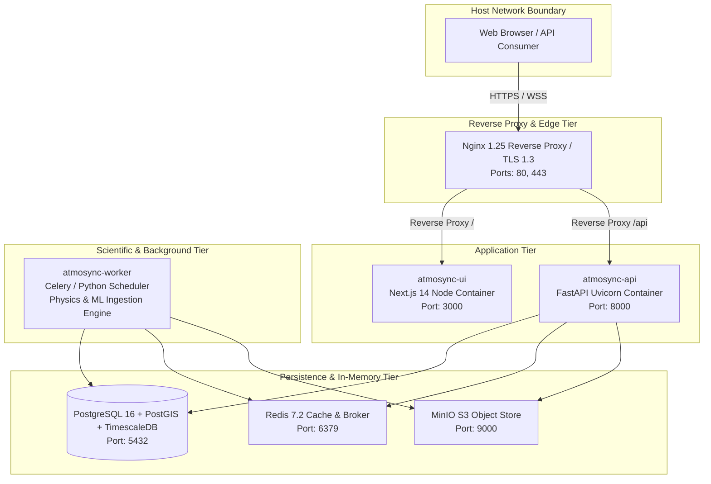

# Deployment Architecture Specification

**Document ID:** `DOC-03-ARCH-005`  
**System:** ATMOSYNC  
**Scope:** Infrastructure, Container Orchestration, Networking, and Target Environments  

---

## 1. Multi-Environment Deployment Strategy

To ensure seamless transition from rapid hackathon evaluation to national operational deployment, the architecture defines three distinct environments:

```
+--------------------------------------------------------------------------------------------------+
|                                    ENVIRONMENT SPECIFICATIONS                                    |
+==================================================================================================+
| ENVIRONMENT A: Local Developer Workstation                                                       |
| - Target: Standard laptop / PC (Windows 11 / macOS / Ubuntu, 16GB RAM, 4-8 CPU cores).          |
| - Setup: Lightweight Docker Compose running backend API, frontend, Redis, and TimescaleDB.      |
| - Physics/ML: Ingests sampled offline test GFS & CAAQMS subsets; inference runs on CPU in <15s.  |
+--------------------------------------------------------------------------------------------------+
| ENVIRONMENT B: SIH Grand Finale Demonstration Environment                                        |
| - Target: Single Cloud Instance (e.g. AWS c6i.2xlarge or GCP c2-standard-8, 8 vCPU, 32GB RAM).   |
| - Orchestration: Full multi-container Docker Compose with Nginx SSL reverse proxy.               |
| - Storage: 100GB NVMe SSD for fast TimescaleDB queries and GeoJSON tile caching.                 |
| - Latency: Live 72-hour forecast re-computation completes in <= 120 seconds.                     |
+--------------------------------------------------------------------------------------------------+
| ENVIRONMENT C: Operational MoES / NCMRWF Supercomputing Environment                             |
| - Target: NCMRWF HPC Cluster (Pratyush / Mihir / PARAM Siddhi) + Cloud Hybrid Dissemination Node.|
| - Compute Split:                                                                                 |
|   1. HPC Nodes (128+ Cores): Executes operational 3D WRF-Chem numerical runs (4x daily).        |
|   2. Cloud Kubernetes Cluster: Ingests raw WRF-Chem NetCDF outputs, runs ML bias downscaler,     |
|      persists forecasts, and powers public API and web dashboard at scale.                       |
+--------------------------------------------------------------------------------------------------+
```

---

## 2. Containerized Service Topology (Docker Compose)



---

## 3. Network Ports & Security Boundaries

| Service | Container Internal Port | Host Mapped Port | Network Scope | Authentication / Security |
| :--- | :--- | :--- | :--- | :--- |
| **Nginx Edge** | 80, 443 | 80, 443 | Public Internet | TLS 1.3, Let's Encrypt SSL, Rate Limiting |
| **Next.js UI** | 3000 | None (Internal) | `app-network` only | Proxied through Nginx |
| **FastAPI Core** | 8000 | None (Internal) | `app-network` only | Proxied through Nginx (`/api/v1/`) |
| **Redis Cache** | 6379 | None (Internal) | `data-network` only | Protected with strong alphanumeric password |
| **TimescaleDB** | 5432 | None (Internal) | `data-network` only | Scram-sha-256 auth; dedicated DB user |
| **MinIO Storage**| 9000 | None (Internal) | `data-network` only | S3 Access Key & Secret Key |

---

## 4. Hardware Sizing & Capacity Planning

| Component | Minimum (Hackathon Demo) | Recommended (Staging) | Production Target (MoES) |
| :--- | :--- | :--- | :--- |
| **CPU Architecture** | 8 vCPUs (x86_64) | 16 vCPUs | 32 vCPUs (API Tier) + HPC (Modeling) |
| **Memory (RAM)** | 16 GB DDR4 | 32 GB DDR4 | 64 GB ECC RAM |
| **Disk Storage** | 60 GB NVMe SSD | 250 GB NVMe SSD | 2 TB Enterprise NVMe Array |
| **GPU Acceleration** | None (CPU ML inference) | Optional NVIDIA T4 (16GB) | NVIDIA A100 / H100 (for GNN training) |
| **Bandwidth** | 50 Mbps | 250 Mbps | 1 Gbps redundant link |

---

## 5. Disaster Recovery & Backup Strategy

1. **Database Snapshots:** Automated daily pg_dump of TimescaleDB relational schemas and station metadata exported to encrypted object storage.
2. **Hypertables Retention Policy:** Raw 1-minute telemetry is dropped after 30 days; 1-hour analytical aggregates are permanently preserved using TimescaleDB continuous aggregates.
3. **Stateless Service Recovery:** If any worker or API container fails, Docker or Kubernetes restarts the container in $< 5\text{ seconds}$ without persistent state loss.

---

## 6. Document Sign-off
- **Lead Systems Architect:** Approved
- **Next Document:** Technology Stack Details (`docs/03-system-architecture/technology-stack.md`)
