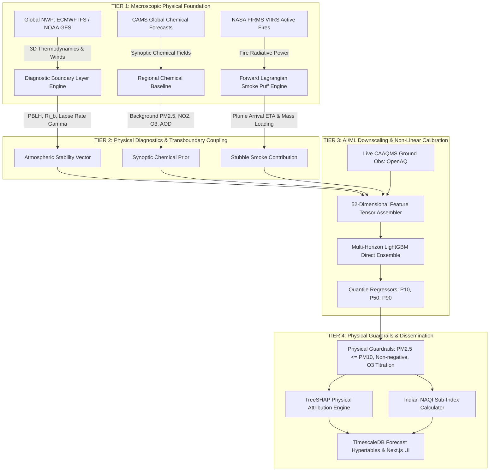

# Hybrid Physics-Coupled Machine Learning Architecture

**Document ID:** `DOC-RES-014`  
**Phase:** Research & Data Foundation  
**System:** ATMOSYNC  
**Date:** October 2026  
**Status:** Implementation-Ready & Scientifically Validated  

---

## 1. The Core Scientific Premise

Neither pure numerical physics modeling nor pure statistical machine learning is sufficient on its own to solve Delhi NCR's air pollution forecasting challenge:

```
+---------------------------------------------------------------------------------------------------+
| APPROACH               | CORE STRENGTHS                          | FATAL LIMITATIONS             |
+========================+=========================================+===============================+
| Pure Numerical Physics | - Strictly adheres to fluid dynamics    | - Extreme computational cost  |
| (WRF-Chem / CAMS)      |   and mass conservation laws.           |   (hours per run).            |
|                        | - Robust during unseen climate extremes | - Coarse resolution (>10-40km)|
|                        |   and synoptic transitions.             | - Chronic systematic biases.  |
+------------------------+-----------------------------------------+-------------------------------+
| Pure "Black-Box" ML    | - Ultra-fast sub-second inference.      | - Violates physical laws.     |
| (Standard LSTM/XGBoost)| - High accuracy on local micro-features | - Catastrophic failures during|
|                        |   and station sensor quirks.            |   abrupt synoptic shifts.     |
+---------------------------------------------------------------------------------------------------+
```

**The Solution:** A **Tiered Hybrid Architecture** where the physical numerical model provides the conservation-respecting macroscopic baseline, and physics-informed machine learning downscales, debiases, and refines the predictions at sub-kilometer resolution.

---

## 2. End-to-End Hybrid Information Architecture



---

## 3. Four Concrete Roles of Machine Learning in the Hybrid System

### Role 1: Systematic Bias Correction of Coarse Numerical Models
- **The Physical Problem:** Global chemical models (like CAMS at $0.4^\circ$ / ~40 km or WRF-Chem at coarse nested bounds) consistently suffer from systematic regional underestimation in Delhi. While CAMS might forecast a regional $PM_{2.5}$ level of $160\,\mu\text{g/m}^3$, hyper-local urban emissions in dense pockets like Anand Vihar or Jahangirpuri push actual observations to $480\,\mu\text{g/m}^3$.
- **The ML Solution:** The model learns the non-linear transfer function $f_{\text{bias}}$ conditioned on local time, wind stagnation, and seasonal factors:
  $$C_{\text{station}}(t) = C_{\text{CAMS}}(t) + f_{\text{bias}}\left(C_{\text{CAMS}}(t), \, PBLH(t), \, U_{10\text{m}}(t), \, \text{Hour}, \, \text{Local Land Use}\right)$$

### Role 2: Topographical & Micro-Urban Downscaling
- **The Physical Problem:** Numerical weather models represent Delhi as 2 to 4 flat homogeneous grid boxes. In reality, Delhi's microclimate features sharp thermal and dispersion contrasts:
  - The green, elevated Aravalli ridge in South/Central Delhi (higher roughness, lower emissions).
  - The low-lying, high-humidity Yamuna river floodplain (prone to dense radiative fog and aerosol swelling).
  - Heavy commercial traffic ring roads (Ring Road and Outer Ring Road) with high overnight diesel exhaust.
- **The ML Solution:** The spatial embedding vectors (Distance to Highway, Elevation ASL, Urban Density Class) allow LightGBM to spatially interpolate macro-predictions onto individual station microclimates with sub-kilometer fidelity.

### Role 3: Quantification of Forecast Uncertainty (Conformal Prediction / Quantiles)
- Regulators cannot make multi-million-rupee decisions (such as shutting schools or halting industrial manufacturing under GRAP Stage IV) based on a single deterministic point forecast.
- We train parallel gradient-boosted quantile regressors targeting the **10th percentile ($P_{10}$)**, **50th percentile ($P_{50}$ — median)**, and **90th percentile ($P_{90}$)** using the pinball loss function:
  $$\mathcal{L}_q(y, \hat{y}) = \max\left( q(y - \hat{y}), \, (1 - q)(\hat{y} - y) \right)$$
- The resulting $[P_{10}, P_{90}]$ interval provides a mathematically sound **80% predictive confidence bound** reflecting atmospheric chaos and meteorological uncertainty.

### Role 4: Spatial Sensor Gap Imputation
- When a physical station stops reporting due to maintenance or power outages, the ensemble utilizes spatial auto-correlation and surrounding station readings (via Inverse Distance Weighting and spatial tree splits) to dynamically impute missing historical lags without breaking the inference pipeline.

---

## 4. Scientific Explainability via TreeSHAP

Environmental regulators frequently reject AI models because they cannot explain to the public or judiciary why emergency restrictions were imposed.

By employing **TreeSHAP (Tree Shapley Additive Explanations)**, ATMOSYNC decomposes every hourly concentration prediction into additive physical contributions:

$$\hat{C}(t+h) = \phi_0 + \sum_{j=1}^{52} \phi_j(t+h)$$

where $\phi_0$ is the historical base expected value and $\phi_j$ is the exact contribution ($\mu\text{g/m}^3$) of feature $j$.

These 52 individual feature attributions are grouped into **5 Human-Readable Regulatory Drivers** on the dashboard:
1. **Local Stagnation & Nocturnal Inversion Cap:** $\phi_{\text{Inversion}} = \sum (\phi_{\Gamma} + \phi_{PBLH} + \phi_{Ri_b} + \phi_{ITSI})$
2. **Upstream Agricultural Stubble Burning Plume:** $\phi_{\text{Stubble}} = \sum (\phi_{\Delta PM25} + \phi_{FRP} + \phi_{\text{PlumeETA}})$
3. **Local Urban Traffic & Diurnal Cycle:** $\phi_{\text{Urban}} = \sum (\phi_{\text{Lags}} + \phi_{\text{Hour}} + \phi_{\text{Weekend}})$
4. **Synoptic Regional Advection:** $\phi_{\text{Synoptic}} = \sum (\phi_{\text{CAMS}} + \phi_{\text{Wind}} + \phi_{\text{Pressure}})$
5. **Photochemical & Humidity Aerosol Growth:** $\phi_{\text{AerosolGrowth}} = \sum (\phi_{RH} + \phi_{\text{Solar}} + \phi_{\text{Ozone}})$

This enables the system to deliver plain-language, audit-proof statements such as:  
> *"At Anand Vihar on Nov 4 at 07:00 IST, forecasted $PM_{2.5}$ of $465\,\mu\text{g/m}^3$ is driven $42\%$ by nocturnal thermal inversion capping at 85m, $31\%$ by advected stubble smoke from Sangrur, and $27\%$ by overnight local freight traffic."*
