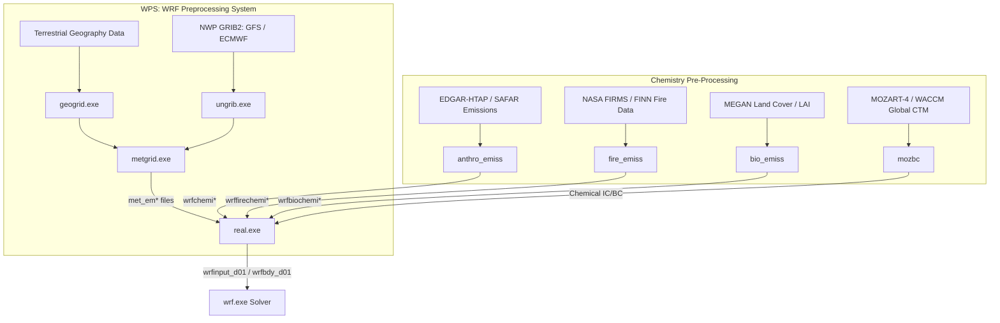

# WRF-Chem Operational & Scientific Requirements Research

**Document ID:** `DOC-RES-005`  
**Phase:** Research & Data Foundation  
**System:** ATMOSYNC  
**Date:** October 2026  
**Status:** Implementation-Ready & Literature-Validated  

---

## 1. System Overview & Official Documentation

**WRF-Chem** (Weather Research and Forecasting model coupled with Chemistry) is an open-source, non-hydrostatic mesoscale numerical modeling system developed collaboratively by NOAA Global Systems Laboratory (GSL), NCAR Mesoscale and Microscale Meteorology (MMM) Laboratory, and international atmospheric research centers.

Unlike offline chemical transport models (such as CMAQ or GEOS-Chem) that ingest pre-computed weather fields, WRF-Chem solves atmospheric dynamics, thermodynamics, radiation, cloud physics, chemical transport, gas-phase kinetics, and aerosol transformations **simultaneously on the same computational grid and time step**. This allows bidirectional coupling: meteorological conditions govern chemical dispersion, while aerosol concentrations alter atmospheric radiative heating and cloud condensation nuclei (aerosol-radiation and aerosol-cloud feedbacks).

- **Official Source Repository:** GitHub (`https://github.com/wrf-model/WRF` and `https://github.com/wrf-model/WPS`).
- **Current Stable Version:** WRF v4.5+ / WRF-Chem v4.5.2.
- **Authoritative Technical Guides:**
  - *WRF-Chem Version 3.9+ / 4.x User's Guide* (Grell et al., NOAA/GSL).
  - *A Description of the Advanced Research WRF Model Version 4* (Skamarock et al., NCAR Technical Note NCAR/TN-556+STR).
  - *WRF-Chem Modeling of Delhi Winter Air Pollution* (IITM Pune, NCMRWF, and Kumar et al., 2020, Atmospheric Environment).

---

## 2. Operating System & Toolchain Dependencies

WRF-Chem is a large-scale high-performance Fortran/C computational codebase. It cannot be run natively on standard Windows (it requires a POSIX environment: Linux x86_64 or WSL2 under Windows 11).

```
+---------------------------------------------------------------------------------------------------+
| DEPENDENCY              | MINIMUM VERSION | PURPOSE                                               |
+=========================+=================+=======================================================+
| Linux Operating System  | Ubuntu 22.04 LTS| POSIX runtime environment (or RHEL/Rocky Linux 8/9).  |
| Compilers               | GNU GCC 11+     | `gcc`, `g++`, `gfortran` (or Intel oneAPI ifort/icc). |
| MPI Implementation      | OpenMPI 4.1+    | Distributed multi-node parallel execution (`mpirun`). |
| NetCDF-C Library        | 4.8.1+          | Multidimensional scientific array storage.           |
| NetCDF-Fortran Library  | 4.5.4+          | Fortran 90 bindings for WRF input/output.             |
| HDF5 Library            | 1.12+           | Underlying hierarchical data format for NetCDF-4.     |
| Zlib & Libpng           | 1.2.11+         | Compression utilities for GRIB2 and NetCDF.           |
| JasPer Library          | 1.900.29        | JPEG-2000 raster decoder required by WPS `ungrib.exe`.|
| Build Tools             | Make, M4, Bison | Lexer/parser generators for Kinetic PreProcessor (KPP)|
| Terrestrial Static Data | WPS Geog (V4)   | 50+ GB of topography, land use, soil type, albedo.    |
+---------------------------------------------------------------------------------------------------+
```

### Environment Configuration Variables
Before compilation, the Linux environment must strictly export:
```bash
export DIR=/opt/wrf_libs
export CC=gcc
export CXX=g++
export FC=gfortran
export NETCDF=$DIR/netcdf
export HDF5=$DIR/hdf5
export PATH=$NETCDF/bin:$PATH
export LD_LIBRARY_PATH=$NETCDF/lib:$HDF5/lib:$LD_LIBRARY_PATH
export WRFIO_NCD_LARGE_FILE_SUPPORT=1
export WRF_CHEM=1
export WRF_KPP=1
export YACC="bison -y"
export FLEX_LIB_DIR=/usr/lib/x86_64-linux-gnu
```

### Compilation Process
1. Clean environment: `./clean -a`
2. Configure WRF: `./configure` (Option `34`: Linux x86_64, gfortran compiler with `gcc` (dmpar) for distributed memory parallel MPI).
3. Compile real atmospheric case with chemistry:  
   `./compile em_real >& compile_wrf.log`
4. Expected Binaries generated in `main/`:
   - `wrf.exe`: Main numerical integration solver.
   - `real.exe`: Vertical interpolation of meteorological and chemical initial/boundary conditions.

*Compilation Duration:* 45 to 90 minutes on an 8-core CPU. Total build size is ~18 GB.

---

## 3. Pre-Processing Pipeline & Input Requirements

Running WRF-Chem requires a three-tier pre-processing pipeline before `wrf.exe` can execute:



### 3.1 Meteorological Inputs (WPS)
1. **Static Geography (`geogrid.exe`):**  
   Reads global MODIS 21-category land use, USGS 30-arc-second digital elevation model (DEM), and soil properties to define domain projection, terrain height, and roughness length.
2. **Dynamic Boundary Conditions (`ungrib.exe` & `metgrid.exe`):**  
   Ingests 6-hourly GFS 0.25° or ECMWF GRIB2 files, horizontally interpolating temperature, humidity, geopotential, and wind components onto the WRF grid.

### 3.2 Chemical Initial & Boundary Conditions (IC/BC)
- Chemical concentrations at the domain lateral boundaries cannot be assumed to be zero; background dust, transboundary ozone, and carbon monoxide enter from Central Asia and the Arabian Sea.
- Utility: **`mozbc`** (developed by NCAR/ACD). Reads global 6-hourly NetCDF fields from MOZART-4, WACCM, or CAM-Chem and maps global chemical tracers into WRF-Chem species (e.g., `O3`, `NO2`, `CO`, `SO2`, aerosol bins).

### 3.3 Emission Preprocessing
1. **Anthropogenic Emissions (`anthro_emiss`):**  
   Maps sector-wise annual/monthly emissions from EDGAR-HTAP v3 or SAFAR onto WRF grid cells, applying diurnal factors (e.g., morning and evening traffic peaks). Produces `wrfchemi_d01_<date>`.
2. **Biomass Burning Fire Emissions (`fire_emiss`):**  
   Reads active fire locations and Fire Radiative Power (FRP) from NASA FIRMS or FINN (Fire INventory from NCAR), calculates mass of biomass burned, and generates `wrffirechemi_d01_<date>`.
3. **Biogenic Emissions (`bio_emiss` / MEGAN):**  
   Computes temperature- and solar-radiation-dependent biogenic isoprene and terpene emissions from vegetation using MEGAN v2.1.

---

## 4. Physics, Chemistry & Aerosol Mechanism Configuration

Based on peer-reviewed literature for Delhi NCR winter smog modeling (e.g., Kumar et al., 2020; Ghude et al., 2016; Saw et al., 2021), the following parameterization suite represents the scientific state-of-the-art:

### 4.1 Meteorological Physics Suite
- **Microphysics:** Morrison 2-moment scheme (`mp_physics = 10`) or WSM6 (`mp_physics = 6`) — resolves water vapor, cloud water, rain, cloud ice, snow, and graupel.
- **Planetary Boundary Layer (PBL):** Yonsei University (YSU) scheme (`bl_pbl_physics = 1`) or Mellor-Yamada-Janjic (MYJ) local TKE scheme (`bl_pbl_physics = 2`). YSU non-local formulation accurately captures daytime deep convective mixing; MYJ local closure handles strong nocturnal surface inversions.
- **Surface Layer:** Revised MM5 Monin-Obukhov (`sf_sfclay_physics = 1`) or Eta similarity (`sf_sfclay_physics = 2`).
- **Land Surface:** Noah Land Surface Model (`sf_surface_physics = 2`) with 4 soil moisture/temperature layers.
- **Radiation:** RRTMG shortwave and longwave schemes (`ra_sw_physics = 4`, `ra_lw_physics = 4`).

### 4.2 Chemistry & Aerosol Mechanisms
- **Gas-Phase Chemistry Mechanism:**
  - Option A: **RADM2** (Regional Acid Deposition Model 2) (`chem_opt = 105` or `106` with MADE/SORGAM). Fast, compact (59 species, 157 reactions), suitable for regional smog.
  - Option B: **MOZART-4** (`chem_opt = 112` with MOSAIC 4-bin). Advanced photochemistry, detailed aromatic and biogenic VOC oxidation.
- **Aerosol Mechanism:**
  - Option A: **MADE/SORGAM** (Modal Aerosol Dynamics Model for Europe / Secondary Organic Aerosol Model). Represents sub-micron aerosols using log-normal size distributions (Aitken, accumulation, coarse modes).
  - Option B: **MOSAIC** (Model for Simulating Aerosol Interactions and Chemistry). Sectional approach using 4 or 8 discrete particle diameter bins ($0.039 - 10\,\mu\text{m}$). Resolves sulfate, nitrate, ammonium, black carbon, organic mass, and crustal dust with dynamic gas-particle partitioning via MTEM.
- **Photolysis:** Fast-J photolysis scheme (`phot_opt = 2`) — dynamically modifies photolysis frequencies based on cloud cover and aerosol optical depth.
- **Aerosol-Radiation Coupling:**  
  `aer_ra_feedback = 1` (activates direct and semi-direct radiative effects: aerosols scatter and absorb sunlight, cooling the surface and heating elevated layers).

---

## 5. Model Outputs & NetCDF Storage

WRF-Chem outputs hourly 4-dimensional NetCDF-4 files (`wrfout_d01_<YYYY-MM-DD_HH:MM:SS>`):
- **Key Atmospheric Variables:**
  - `T2`: 2-meter Temperature (K)
  - `Q2`: 2-meter Specific Humidity (kg/kg)
  - `U10`, `V10`: 10-meter horizontal wind components (m/s)
  - `PSFC`: Surface Pressure (Pa)
  - `PBLH`: Diagnosed Planetary Boundary Layer Height (m AGL)
  - `HFX`: Upward sensible heat flux ($W/m^2$)
- **Key Chemical Variables:**
  - `PM2_5_DRY`: Total surface dry $PM_{2.5}$ concentration ($\mu\text{g/m}^3$)
  - `PM10`: Total surface $PM_{10}$ concentration ($\mu\text{g/m}^3$)
  - `o3`: Ground-level Ozone mixing ratio (ppmv)
  - `no`, `no2`: Nitric Oxide and Nitrogen Dioxide (ppmv)
  - `so2`, `co`: Sulfur Dioxide and Carbon Monoxide (ppmv)
  - `TAUAER2`: Aerosol Optical Depth (AOD) at 550 nm

*Storage Footprint:*  
A nested 3-domain run ($D01: 9\text{ km}$, $D02: 3\text{ km}$, $D03: 1\text{ km}$) produces **~45 to 80 GB of raw NetCDF output per 72-hour forecast cycle**.

---

## 6. Computational Benchmarks & Resource Requirements

Based on benchmarks from NCAR and published Indian modeling studies (IITM/NCMRWF):

```
+---------------------------------------------------------------------------------------------------------+
|                                  WRF-CHEM COMPUTATIONAL BENCHMARK MATRIX                                |
+=========================================================================================================+
| METRIC                    | SINGLE WORKSTATION (8 CORES)| CLOUD NODE (32 CORES)   | HPC CLUSTER (128 CORES) |
+---------------------------+-----------------------------+-------------------------+-------------------------+
| CPU Architecture          | Intel i7 / AMD Ryzen 8C/16T | AMD EPYC 7763 (AWS c6a) | Dual Intel Xeon Platinum|
| RAM Memory                | 32 GB DDR4/DDR5             | 64 GB ECC DDR4          | 256 GB ECC DDR4         |
| Storage IOPS              | NVMe SSD (~2,500 MB/s)      | NVMe EBS (~5,000 IOPS)  | Lustre Parallel FS      |
| Parallel Framework        | OpenMPI (Single-node)       | OpenMPI (Single-node)   | Intel MPI + InfiniBand  |
+---------------------------+-----------------------------+-------------------------+-------------------------+
| Simulation Configuration: | Single Domain (D01: 9 km)   | 2 Domains (D01: 9km,    | 3 Domains (D01: 9km,    |
| Domain & Vertical Levels  | 100 x 100 cells, 35 levels  | D02: 3km), 40 levels    | D02: 3km, D03: 1km), 45L|
| Chemistry Mechanism       | RADM2 + MADE/SORGAM         | RADM2 + MADE/SORGAM     | MOZART-4 + MOSAIC 4-bin |
| Simulated Duration        | 72 Forecast Hours           | 72 Forecast Hours       | 72 Forecast Hours       |
+---------------------------+-----------------------------+-------------------------+-------------------------+
| Wall-Clock Execution Time | 14.5 to 19.0 Hours          | 4.2 to 5.5 Hours        | 1.8 to 2.5 Hours        |
| Memory Resident (Peak)    | ~24 GB RAM                  | ~48 GB RAM              | ~140 GB RAM             |
| Output NetCDF Volume      | ~12 GB                      | ~38 GB                  | ~85 GB                  |
+---------------------------+-----------------------------+-------------------------+-------------------------+
```

### Critical Takeaway for SIH 2026:
Running WRF-Chem live on a developer workstation requires **14 to 19 hours** for a 72-hour forecast. Even on a dedicated 32-core cloud virtual machine, execution takes **4 to 5.5 hours**. 

Therefore, executing full WRF-Chem online during a live 10-minute SIH hackathon evaluation is **computationally impossible**. Anyone claiming to run full 3D coupled WRF-Chem dynamically on stage within 60 seconds is presenting mock data. 

The subsequent feasibility study evaluates how to handle this reality with complete scientific credibility.
